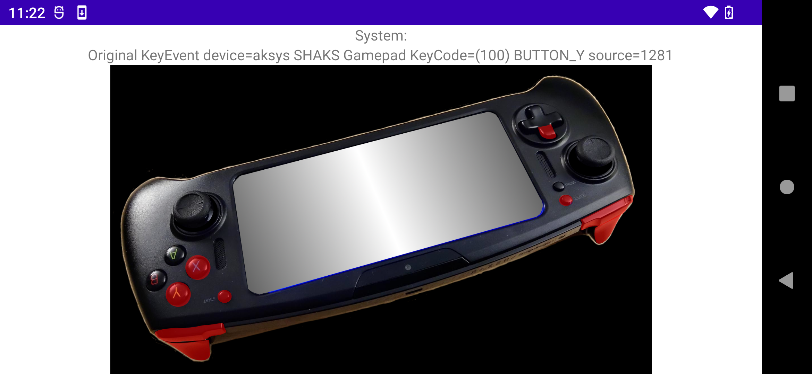

# Android Java Virtual Controller

* This input sample shows how to interact with touch, axises, and buttons available on the developer kit.



* The [activity_main.xml](app/src/main/res/layout/activity_main.xml) layout defines the user interface and image overlays.

* MotionEvents use the following axis values.

```
public static final int AXIS_LS_X = MotionEvent.AXIS_X; //0
public static final int AXIS_LS_Y = MotionEvent.AXIS_Y; //1
public static final int AXIS_RS_X = MotionEvent.AXIS_Z; //11
public static final int AXIS_RS_Y = MotionEvent.AXIS_RZ; //14
public static final int AXIS_L2 = MotionEvent.AXIS_BRAKE; //23
public static final int AXIS_R2 = MotionEvent.AXIS_GAS; //22
```

* Button events use the following button values.

```
public static final int BUTTON_A = 96;
public static final int BUTTON_B = 97;
public static final int BUTTON_X = 99;
public static final int BUTTON_Y = 100;
public static final int BUTTON_L1 = 102;
public static final int BUTTON_L2 = 104;
public static final int BUTTON_R1 = 103;
public static final int BUTTON_R2 = 105;
public static final int BUTTON_L3 = 106;
public static final int BUTTON_R3 = 107;
public static final int BUTTON_DPAD_UP = 19;
public static final int BUTTON_DPAD_DOWN = 20;
public static final int BUTTON_DPAD_RIGHT = 22;
public static final int BUTTON_DPAD_LEFT = 21;
public static final int BUTTON_SELECT = 109;
public static final int BUTTON_START = 108;
public static final int BUTTON_VOLUME_UP = 24;
public static final int BUTTON_VOLUME_DOWN = 25;
```

* The [MainActivity.java](app/src/main/java/com/razer/dracovirtualcontroller/MainActivity.java) activity detects input events to toggle and transform the virtual device images.

* The touch listener can detect tap events.

```
ViewGroup mainLayout =
  (ViewGroup)this.findViewById(android.R.id.content);

mainLayout.setOnTouchListener((view, event) -> {
    if (event.getAction() == MotionEvent.ACTION_DOWN) {

    } else if (event.getAction() == MotionEvent.ACTION_UP) {

    }
    return true;
});
```

* The sample does not detect the menu button which immediately shows the Android launcher when pressed.

* The sample does not detect the power button which immediately locks the Android device on a single press.
